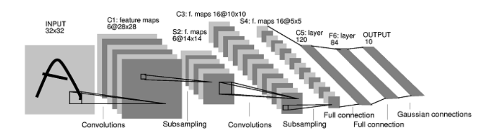
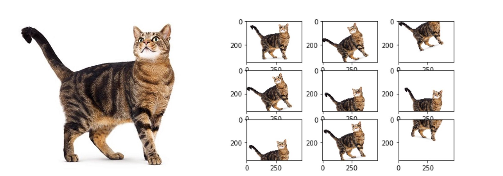

# An image classifer based on a Convolutional network

 In this repository, there is an image classification algorithm based on the original architecture of CNNs. So, The purpose is to explain the original CNN architecture, train it to classify two different categories of images, and finally retrain it in order to improve its accuracy. 

With that being said, we have now to choose which category classes we want our model to classify. Let’s take for instance our categories as images of dogs and cats. The process of implementing this image classifier is described as follows:

### 1.Data preparation process

Our input is a training dataset that consists of N images, each labeled with one of K different classes. 
All we have to do in this step is initializing training and validation data, keeping them in two different folders.
To collect the images we can use our own images, or we can download an amount from the internet, the most convenient way is to use an opensource dataset, for our example, we picked arround 800 images from this opensource dataset [Kaggle dogs-vs-cats][1] 

### 2. Convolutional neural network model
A _convolutional neural network_ called a CNN, also known as a ConNnet.
After preparing our data, we want to feed it to our neural network for training, so we want to understand what happens inside the neural network, namely in its architecture.
Since there are a lot of types of CNNs, we focus on discussing the original version of CNNs that is proposed by Yann LeCan in 1998.

A ConvNet is made up of Layers, input, and an output layer, as well as multiple hidden layers. Every Layer has a simple API: It transforms an input 3D volume to an output 3D volume with some differential function that may or may not have parameters.

Figure 1. The architecture of LeNet-5, a Convolutional Neural Network. LeCun et al., 1998

The hidden layers of a CNN typically consist of a series of convolutional layers that convolve with a multiplication. The activation function is commonly a RELU layer and is subsequently followed by additional convolutions such as pooling layers, fully connected layers, and normalization layers referred to as hidden layers because their inputs and outputs are masked by the activation function and final convolution.

### 3. Training

The fully connected layer uses a classifier in the output layer. The classifier is usually a softmax activation function.
Everything is trained through forward- and backward propagation through many, many epochs. We wind up with a very well defined neural network where all the weights and features are trained.
Once your network has been trained you can pass in an image of a dog to it for example and you can see, that you have a 95% probability that your image is a dog and a 5% probability that your image is a cat.

#### 3.1. Data Augmentation

When our training accuracy is not high because our dataset is somehow small, we can use data augmentation to achieve better accuracy.
Data augmentation is often used in order to improve generalization properties. Typically, random cropping of rescaled images together with random horizontal flipping and random RGB color and brightness shifts are used.

<link rel="stylesheet" type = "images_folder" href="style.css">

Figure .3. Augmenting an image of a cat to some amount of scales.

#### 3.2. Transfer learning

Instead of data augmentation, a common and highly effective approach to deep learning on small image datasets is to use a pre-trained network. A pre-trained network is a saved network that was previously trained on a large dataset. The idea is to feed the weights of this pre-trained model to our neural network, this will end up achieving higher accuracy.

### 4. Ressources
#### 4.1. On the Cloud

Colab. Practice Immediately 8 . Labs 9: Introduction to Deep Learning (MIT 6.S191)
Free GPU, compute via Colab https://colab.research.google.com/notebooks/welcome.ipynb.
Colab can open notebooks directly from GitHub by simply replacing "http://github.com" with
"http://colab.research.google.com/github/ " in the notebook URL.
Colab Pro https://colab.research.google.com/signup.

#### 4.2. On a Local Machine

_JupyterLab_ is an interactive development environment for working with notebooks, code and data 10.
Install Anaconda and launch ‘Anaconda Navigator’
Update Jupyterlab and launch the application. Under Notebook, click on ‘Python 3’

#### 4.3. Install the deep learning Software
##### 3.3.1. TensorFlow

[_TensorFlow Hub_][2] is a library for reusable machine learning modules.
[_TensorFlow.js_][3] allows machine learning to happen within the web browser.

*  [TensorFlow Lite][4] for Microcontrollers
*  [TensorBoard][5] in Jupyter Notebooks. [Colab][6].
*  TensorFlow 2.0 + Keras Crash Course. [Colab][7].
*  tf.keras (TensorFlow 2.0) for Researchers: Crash Course. [Colab][8].
*  [TensorFlow Tutorials][9].
*  TensorFlow 2.0: basic ops, gradients, data preprocessing and augmentation, training and saving. [Colab][10]

[1]: https://www.kaggle.com/c/dogs-vs-cats/data
[2]: https://www.tensorflow.org/hub
[3]: https://www.tensorflow.org/js/
[4]: https://www.tensorflow.org/lite/microcontrollers
[5]: https://www.tensorflow.org/tensorboard/tensorboard_in_notebooks
[6]: https://colab.research.google.com/github/tensorflow/tensorboard/blob/master/docs/tensorboard_in_%20notebooks.ipynb
[7]: https://colab.research.google.com/drive/1UCJt8EYjlzCs1H1d1X0iDGYJsHKwu-NO
[8]: https://colab.research.google.com/drive/14CvUNTaX1OFHDfaKaaZzrBsvMfhCOHIR
[9]: https://www.tensorflow.org/tutorials
[10]: https://colab.research.google.com/github/zaidalyafeai/Notebooks/blob/master/TF_2_0.ipynb

